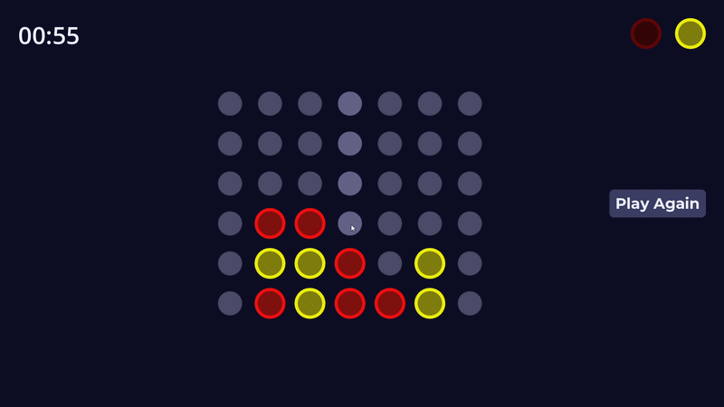

# Connect Four – Godot 4

A clean and readable Connect Four implementation built in Godot 4, designed as a learning resource.

## Features

- Piece drop with bounce and squash-and-stretch animations
- Win detection in all 4 directions (horizontal, vertical, both diagonals)
- Animated board reset with staggered piece removal
- Global signal bus architecture — no hard node references between scenes

## Built with

- [Godot Engine](https://godotengine.org/) v4.6.2

## How to open

1. Clone or download this repository
2. Open Godot 4.6.2
3. Click **Import** and select the `project.godot` file
4. Hit **Play** (F5)

## Good starting points to extend this project

This project is designed to be a clean base. Some ideas:

- **AI opponent** — the board state is a simple dictionary, perfect for a minimax algorithm
- **Online multiplayer** — signals and turn logic are already decoupled
- **Mobile support** — input layer is isolated in the Slot script
- **Menus and scoring** — the HUD script is ready to be expanded

## License

MIT — use it however you want. See [LICENSE](LICENSE) for details.

## Credits

Code and implementation by [AlejandroChiquillo].

Code cleaned up and commented with the help of [Claude](https://claude.ai) (Anthropic).

Visual style inspired by [2swap]:
[I Solved Connect 4](https://youtu.be/KaljD3Q3ct0?si=hhrsplZ3rG9_Ju9f).
